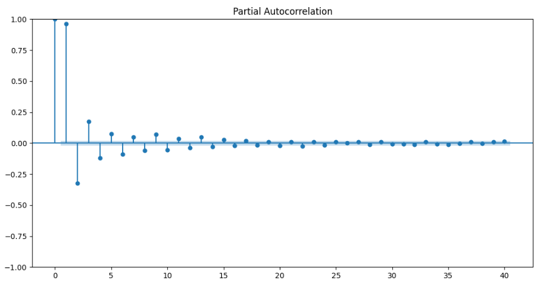

## Devloped by: Sreevalsan V
## Register Number: 212223240158
## Date: 3-03-2025

# Ex.No:04           FIT ARMA MODEL FOR TIME SERIES

### AIM:
To implement ARMA model in python.

### ALGORITHM:
1. Import necessary libraries.

2. Set up matplotlib settings for figure size.

3. Define an ARMA(1,1) process with coefficients ar1 and ma1, and generate a sample of 1000
data points using the ArmaProcess class. Plot the generated time series and set the title and x-axis limits.

4. Display the autocorrelation and partial autocorrelation plots for the ARMA(1,1) process using plot_acf and plot_pacf.

5. Define an ARMA(2,2) process with coefficients ar2 and ma2, and generate a sample of 10000 data points using the ArmaProcess class. Plot the generated time series and set the title and x-axis limits.

6. Display the autocorrelation and partial autocorrelation plots for the ARMA(2,2) process using plot_acf and plot_pacf.


### PROGRAM:

Import necessary Modules and Functions
```py
import pandas as pd
import numpy as np
import matplotlib.pyplot as plt
from statsmodels.tsa.arima.model import ARIMA
from statsmodels.tsa.arima_process import ArmaProcess
from statsmodels.graphics.tsaplots import plot_acf, plot_pacf
```
Load dataset
```py
data=pd.read_csv('/content/AirPassengers.csv')
```
Declare required variables and set figure size, and visualise the data
```py
N=1000
plt.rcParams['figure.figsize'] = [12, 6] #plt.rcParams is a dictionary-like object in Matplotlib that stores global settings for plots. The "rc" in rcParams stands for runtime configuration. It allows you to customize default styles for figures, fonts, colors, sizes, and more.

X=data['#Passengers']
plt.plot(X)
plt.title('Original Data')
plt.show()
plt.subplot(2, 1, 1)
plot_acf(X, lags=len(X)/4, ax=plt.gca())
plt.title('Original Data ACF')
plt.subplot(2, 1, 2)
plot_pacf(X, lags=len(X)/4, ax=plt.gca())
plt.title('Original Data PACF')
plt.tight_layout()
plt.show()
```
Fitting the ARMA(1,1) model and deriving parameters
```py
arma11_model = ARIMA(X, order=(1, 0, 1)).fit()
phi1_arma11 = arma11_model.params['ar.L1']
theta1_arma11 = arma11_model.params['ma.L1']
```
Simulate ARMA(1,1) Process
```py
ar1 = np.array([1, -phi1_arma11])
ma1 = np.array([1, theta1_arma11])
ARMA_1 = ArmaProcess(ar1, ma1).generate_sample(nsample=N)
plt.plot(ARMA_1)
plt.title('Simulated ARMA(1,1) Process')
plt.xlim([0, 500])
plt.show()
```
Plot ACF and PACF for ARMA(1,1)
```py
plot_acf(ARMA_1)
plt.show()
plot_pacf(ARMA_1)
plt.show()
```
Fitting the ARMA(1,1) model and deriving parameters
```py
arma22_model = ARIMA(X, order=(2, 0, 2)).fit()
phi1_arma22 = arma22_model.params['ar.L1']
phi2_arma22 = arma22_model.params['ar.L2']
theta1_arma22 = arma22_model.params['ma.L1']
theta2_arma22 = arma22_model.params['ma.L2']
```
Simulate ARMA(2,2) Process
```py
ar_2 = np.array([1, -phi1_arma22, -phi2_arma22])  
ma_2 = np.array([1, theta1_arma22, theta2_arma22])  
ARMA_2 = ArmaProcess(ar2, ma2).generate_sample(nsample=N*10)
plt.plot(ARMA_2)
plt.title('Simulated ARMA(2,2) Process')
plt.xlim([0, 500])
plt.show()
```
Plot ACF and PACF for ARMA(2,2)
```py
plot_acf(ARMA_2)
plt.show()
plot_pacf(ARMA_2)
plt.show()

```

### OUTPUT:

Original data:


Partial Autocorrelation:-


Autocorrelation:-



SIMULATED ARMA(1,1) PROCESS:


Partial Autocorrelation:-


Autocorrelation:-


SIMULATED ARMA(2,2) PROCESS:


Partial Autocorrelation


Autocorrelation


### RESULT:

Thus, a python program is created to fit ARMA Model successfully.
